<p align="center">
  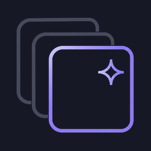
</p>

<h1 align="center">Memora</h1>

<p align="center">
  <strong>Your visual memory.</strong><br>
  An open-source Android app that turns the images you keep into a private, searchable memory you can talk to.
</p>

<p align="center">
  <a href="https://github.com/GameOn223/memora/actions/workflows/ci.yml"></a>
  <a href="LICENSE"></a>
  
</p>

<p align="center">
  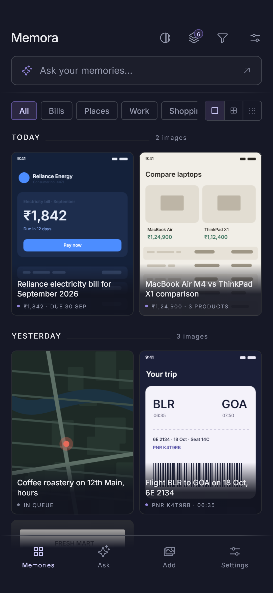
  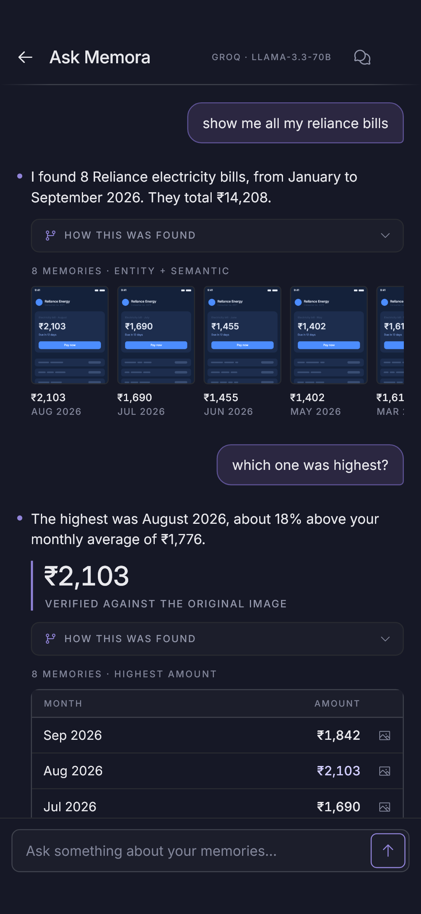
  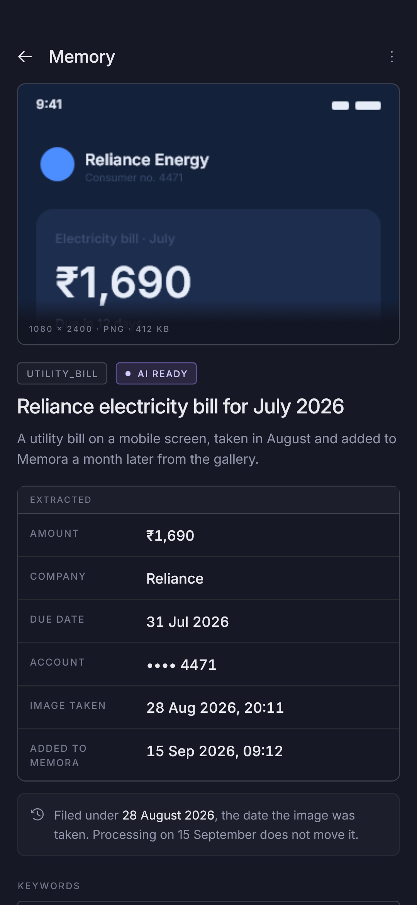
  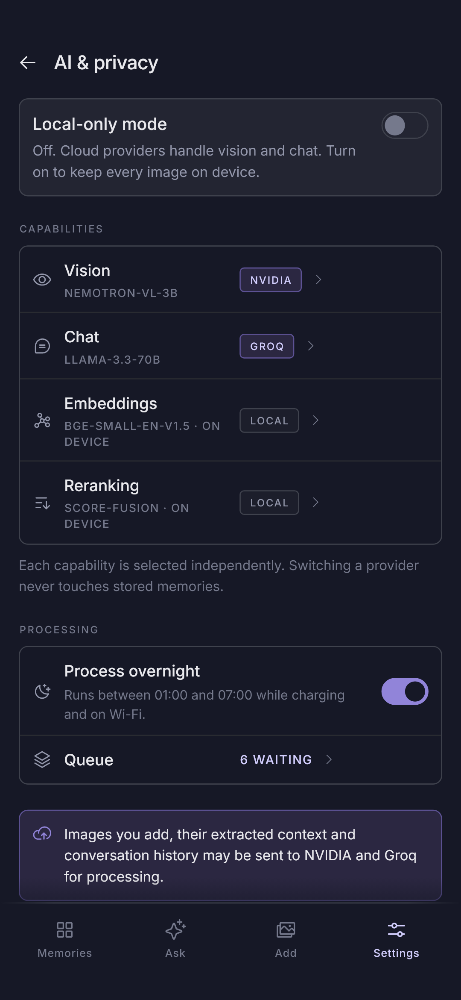
</p>

You screenshot a bill, a price, a booking reference, an address. Weeks later you know you saw it, but not where. Memora keeps those images, understands what's in them, and lets you ask:

> show me all my reliance bills

> which one was highest?

> what was the price of that laptop i was looking at?

Every answer points back at the original image, so you can check it yourself.

## What makes it different

- **You choose what's remembered.** Memora never watches your screen. A memory exists because you picked the image from your gallery, shared it to Memora, or tapped the Memora tile.
- **Everything stays on the phone.** Images, the database, embeddings and every conversation live in app-private storage. There's no account and no Memora server.
- **Your AI, your key.** Vision, chat, embeddings and reranking are chosen independently. Use OpenAI, Groq, NVIDIA, OpenRouter, Gemini or Anthropic with your own key, a model on your own machine through Ollama or LM Studio, or the on-device path with no network at all.
- **Nothing is locked in.** Switch providers whenever you like and your memories stay put. AI output is derived data and can always be regenerated.
- **Answers you can check.** Every answer cites the memories behind it, and a panel shows the actual searches that found them.

## How it works

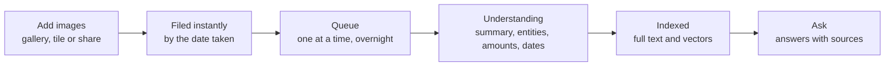

Adding is instant and never waits on AI. Understanding happens in the background, one image at a time, overnight while charging by default, because vision calls are the expensive part of a large backlog. Images are browsable the moment they're added.

## Screens

| | | |
|---|---|---|
|  | 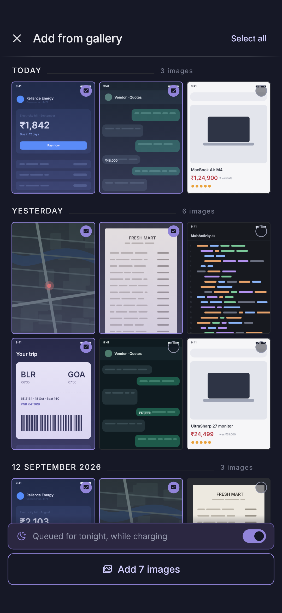 | 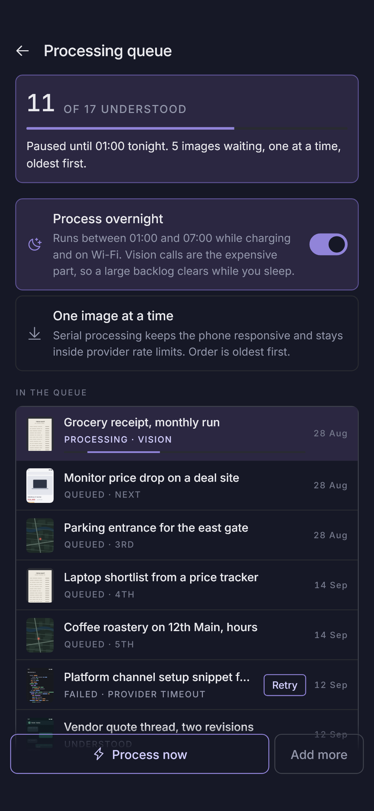 |
| Memories, grouped by the date each image was taken | Add any number from your gallery | A queue you can see, pause and retry |
|  | 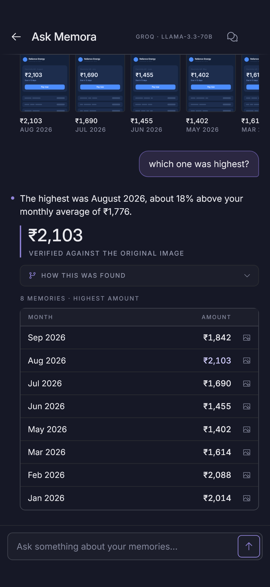 |  |
| Ask in your own words | Comparisons come back as a table | Everything Memora understood, with the original |
|  | 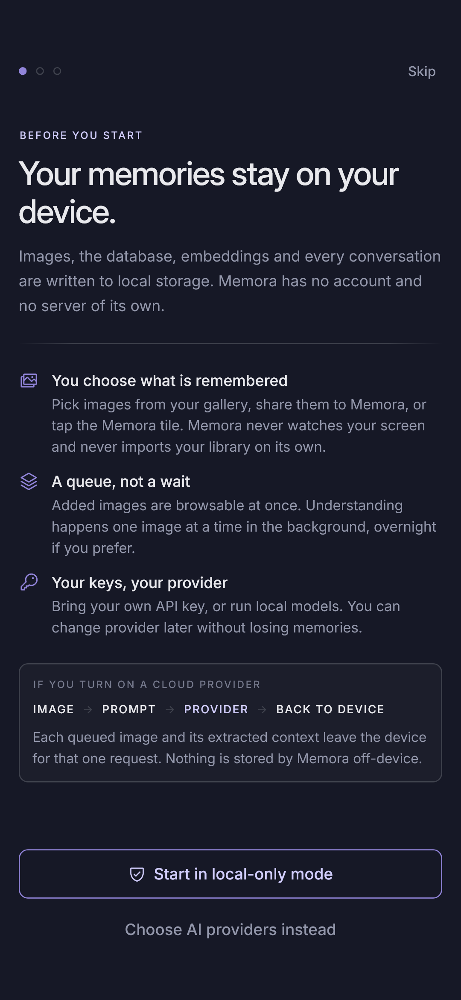 | 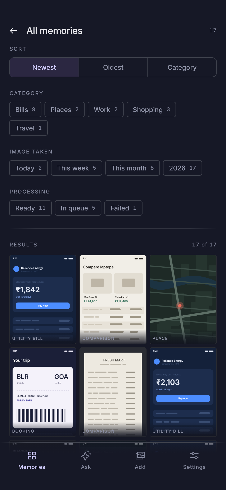 |
| A provider per capability, keys in the Keystore | Local-only from the first launch | Browse and filter without chat |

## Privacy

| | |
|---|---|
| Account | None. Memora has no server. |
| Storage | App-private. Android backup is off for images, the database and secrets. |
| Telemetry | None. No analytics SDK. |
| API keys | Encrypted with AES-256-GCM under an Android Keystore key, never in the database, logs or exports. |
| Cloud use | Only the providers you choose, disclosed before you enable one. |
| Local-only mode | Blocks every request to a public host. A model on the phone or on your own machine still works, and anything the device can't do is shown as unavailable rather than quietly sent away. |
| Your data | Export everything as a documented zip, and delete it for good whenever you like. |

## AI providers

| Provider | Vision | Chat | Embeddings | Reranking | Needs a key |
|---|:---:|:---:|:---:|:---:|:---:|
| On this device | yes | yes | yes | yes | no |
| Ollama or LM Studio | yes | yes | yes | | no |
| OpenAI | yes | yes | yes | | yes |
| Groq | yes | yes | | | yes |
| NVIDIA | yes | yes | yes | yes | yes |
| OpenRouter | yes | yes | | | yes |
| Google Gemini | yes | yes | yes | | yes |
| Anthropic | yes | yes | | | yes |
| Any OpenAI-compatible URL | yes | yes | yes | | optional |

On-device vision reads text with ML Kit and pulls out amounts, dates and reference numbers with rules. It's deliberately basic, and it works with no network and no key. On-device semantic search uses bge-small-en-v1.5 (34 MB), downloaded once from settings and checked against a pinned hash.

On-device chat needs a model you bring. Settings lists Gemma 3 1B (about 550 MB) and Gemma 3n E2B (about 3 GB, which also reads images), says whether your phone has the memory for each, and imports the file you downloaded. Memora can't fetch them: the Gemma licence is accepted on the model's own page. A model here is slower than a cloud one and it uses battery, and nothing leaves the phone.

Adding a provider is a descriptor, a client and a few tests. See [docs/providers.md](docs/providers.md).

## Install

Grab the APK from [Releases](https://github.com/GameOn223/memora/releases) and install it. Android 8.0 or newer.

### Build from source

```bash
git clone https://github.com/GameOn223/memora.git
cd memora
flutter pub get
cd app && flutter run
```

You'll need Flutter 3.47 and an Android SDK with platform 36 and NDK 28.2.13676358. See [CONTRIBUTING.md](CONTRIBUTING.md) for the full setup and the checks CI runs.

### First run

Onboarding offers two paths. **Start in local-only mode** works immediately with nothing to configure. **Choose AI providers** takes you to settings, where each capability gets its own provider and model, and your key goes into the Keystore.

To capture without opening the app, add the Memora tile to your Quick Settings panel from settings. Turn on the accessibility capture option there too and the tile saves the screen with no dialog, otherwise Android asks for permission each time.

## How it's built

```
app/                 Flutter app and the Android (Kotlin) layer
packages/
  memora_core/       domain model, ports, pipeline, retrieval, chat agent
  memora_database/   SQLite, FTS5, vectors, migrations
  memora_providers/  AI provider adapters
docs/                architecture and contributor docs
```

The business logic is pure Dart, so most of the project is testable on a laptop with `dart test` and no phone. Kotlin handles what has to be native: capture, gallery access, background work, OCR, on-device inference and the Keystore. The two sides talk over a typed Pigeon bridge.

Search combines three strategies: structured filters for things like "over ₹2000 last year", full-text search over what the image said, and vector search for what it meant. Results are merged and reranked, and the chat model reaches data only through typed, read-only tools. It never writes SQL.

[docs/architecture.md](docs/architecture.md) covers all of it, and it's the first thing to read before a change that crosses a package.

## Roadmap

Shipping in v0.1: gallery import, tile and share capture, the background queue, cloud and on-device providers, hybrid search, chat with sources, export and delete.

Next: visual verification everywhere, smarter reranking, embedding migration between models, richer filtering, and more ways to capture. See the [issues](https://github.com/GameOn223/memora/issues).

## Contributing

Contributions are welcome, including ones written with AI tools, as long as you understand the change, have tested it, and can explain it in review. Start with [CONTRIBUTING.md](CONTRIBUTING.md), and see [AGENTS.md](AGENTS.md) if you work with a coding agent.

## Support

Bugs and ideas belong in [issues](https://github.com/GameOn223/memora/issues), where everyone can see them and help.

For anything you would rather not post in public, email **jayrathod.dev@gmail.com**. Security problems have their own route in [SECURITY.md](SECURITY.md).

## License

[Apache 2.0](LICENSE).
