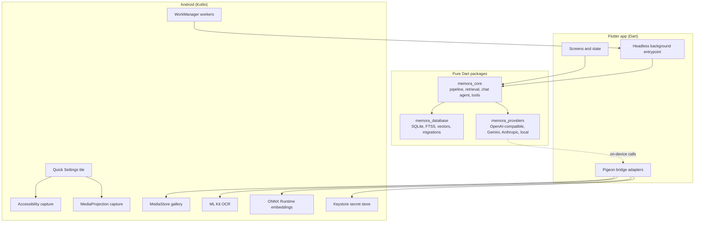
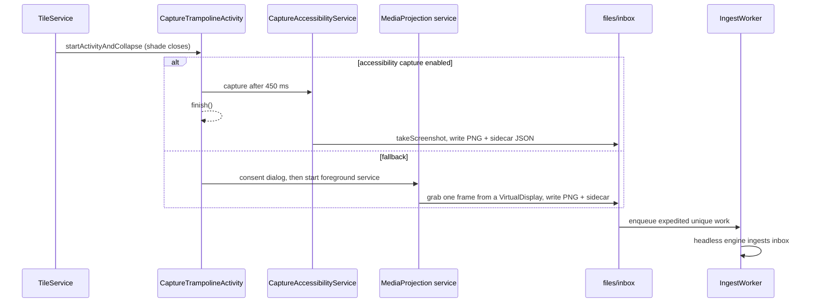
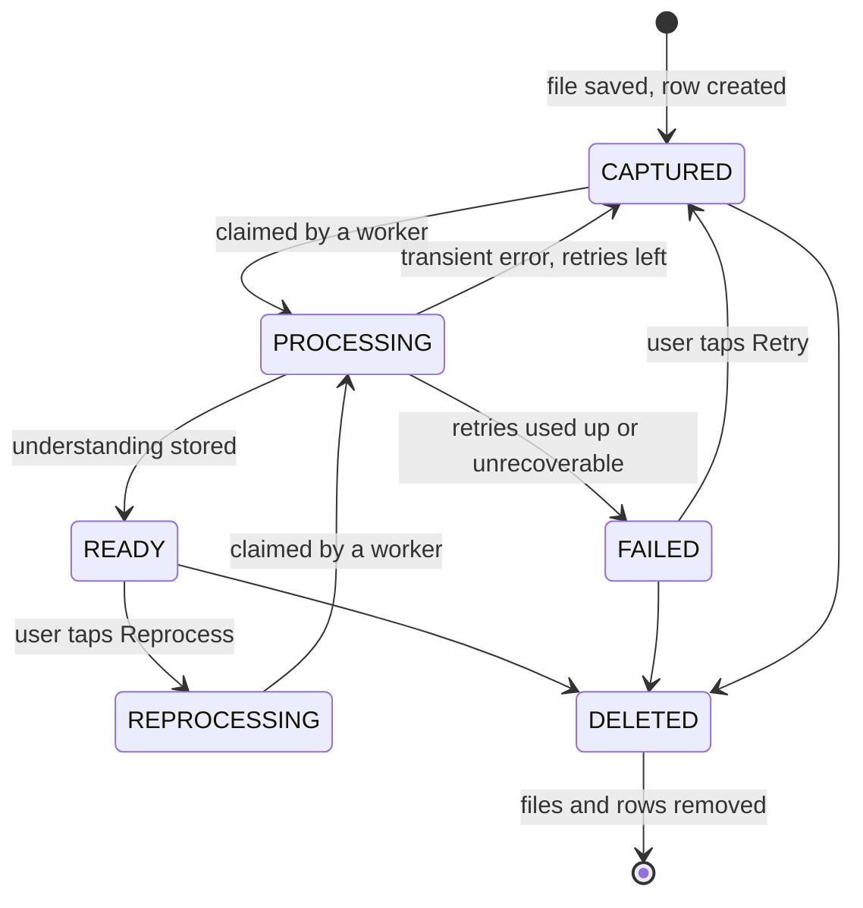
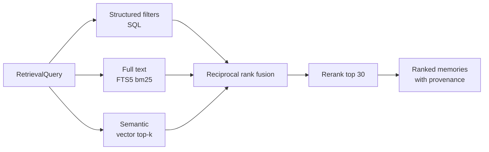

# Memora architecture

This document describes how Memora is put together and why. Read it before making a change that crosses a package boundary, adds a provider, or touches the database schema.

If something here disagrees with the code, the code wins, and the doc needs a fix. Please open a PR for it.

## Contents

1. [Goals and rules](#1-goals-and-rules)
2. [System overview](#2-system-overview)
3. [Repository layout](#3-repository-layout)
4. [Getting images in](#4-getting-images-in)
5. [The processing queue](#5-the-processing-queue)
6. [Data model](#6-data-model)
7. [AI capabilities and providers](#7-ai-capabilities-and-providers)
8. [Retrieval](#8-retrieval)
9. [Chat](#9-chat)
10. [Platform bridge](#10-platform-bridge)
11. [User interface](#11-user-interface)
12. [Privacy and security](#12-privacy-and-security)
13. [Failure handling](#13-failure-handling)
14. [Export format](#14-export-format)
15. [Testing](#15-testing)
16. [Decision log](#16-decision-log)

## 1. Goals and rules

Memora is a visual memory for Android. You pick images (from the gallery, the Quick Settings tile, or the share sheet), Memora files them right away, understands them in the background, and lets you search and ask questions about them later. All data lives on the phone.

These rules are enforced in review. A PR that breaks one needs a very good reason and a change to this section.

| # | Rule | What it means in code |
|---|------|-----------------------|
| 1 | No provider logic in core | `memora_core` never imports a provider package or mentions a vendor by name. |
| 2 | No cloud storage | Storage ports are implemented only by on-device code. |
| 3 | The original image is immutable | Imported files are copied once and never rewritten. Only deletion removes them. |
| 4 | AI output is replaceable | Everything a model produced can be dropped and regenerated with "Reprocess". |
| 5 | Every capability is replaceable | Vision, chat, embeddings and reranking are chosen independently. |
| 6 | Embeddings are versioned | Vectors carry model id, version and dimensions. Mismatched vectors are never compared. |
| 7 | Agents get no database access | The chat model sees typed tools. It can't send SQL. |
| 8 | Retrieval tools are read-only | Tools return data. Writes happen in application services. |
| 9 | Capture never waits on AI | An image is saved and browsable before any model runs. |
| 10 | Data stays exportable | There is a documented export format covering everything a user owns. |

## 2. System overview



The split is deliberate. Anything that has to talk to Android lives in Kotlin and is exposed through a typed bridge. Everything else is plain Dart, so it can be tested with `dart test` on any laptop without a phone.

## 3. Repository layout

```
memora/
├── app/                          Flutter application
│   ├── lib/
│   │   ├── main.dart             UI entrypoint
│   │   ├── background_main.dart  headless entrypoint used by WorkManager
│   │   └── src/
│   │       ├── bootstrap/        composition root: opens the database, builds services
│   │       ├── platform/         Pigeon output and adapters that implement core ports
│   │       ├── theme/            Nocturne tokens as a ThemeExtension
│   │       ├── routing/          go_router configuration
│   │       ├── features/         one folder per screen
│   │       └── widgets/          shared widgets
│   ├── pigeons/                  bridge definitions (source of truth for generated code)
│   └── android/app/src/main/kotlin/io/github/gameon223/memora/
│       ├── bridge/               host API implementations
│       ├── capture/              tile, accessibility service, MediaProjection
│       ├── gallery/              MediaStore queries and import
│       ├── background/           workers, scheduling, headless engine runner
│       ├── inference/            OCR and ONNX embedding runtime
│       └── secure/               Keystore-backed secret store
├── packages/
│   ├── memora_core/              domain model, ports, services
│   ├── memora_database/          SQLite implementation of the storage ports
│   └── memora_providers/         AI provider adapters
└── docs/
```

The three packages and the app form a Dart pub workspace, so one `dart pub get` at the root resolves everything.

### Dependency direction

```
app ──► memora_providers ──► memora_core
 └────► memora_database  ──► memora_core
```

`memora_core` depends on nothing Memora-specific. Providers and the database depend on core interfaces. The app wires them together in `bootstrap/`.

## 4. Getting images in

There are three ways in. All of them end in the same place: a file under app storage and a `memories` row with status `CAPTURED`.

### 4.1 Gallery import (primary)

The Add tab shows the device gallery grouped by the date each image was taken.

1. Kotlin queries `MediaStore.Images` for id, `DATE_TAKEN`, size, dimensions and mime type. Thumbnails come from `ContentResolver.loadThumbnail`.
2. The user selects any number of images and confirms.
3. For each selected image, Kotlin streams the bytes into `files/originals/<uuid>.<ext>` and reports the file path, SHA-256, dimensions and taken time.
4. Dart inserts one row per image in a single transaction. Images whose SHA-256 already exists are skipped and counted, so the toast can say "3 were already in Memora".
5. Thumbnails (512 px on the long edge, WebP) are generated in Dart after the insert. The grid shows a placeholder until they exist.

Permissions: `READ_MEDIA_IMAGES` on Android 13+, `READ_MEDIA_VISUAL_USER_SELECTED` for partial access on 14+, `READ_EXTERNAL_STORAGE` on 12 and below. If the user declines, the Add tab offers the system Photo Picker, which needs no permission.

**Taken time.** `taken_at` comes from `DATE_TAKEN`, then EXIF `DateTimeOriginal`, then the file's modified time. Memories are filed by `taken_at`, so an August screenshot added in September shows up under August with a small "added later" glyph.

### 4.2 Quick Settings tile

The tile lets you save what's on screen without opening Memora.



- **Accessibility path.** Needs Android 11+ and the user has to switch on "Memora capture" in Accessibility settings. The service declares `canTakeScreenshot` and does nothing else. It doesn't read window content or listen to events.
- **MediaProjection path.** Works everywhere Memora runs, but Android shows a consent dialog for every capture. The foreground service is typed `mediaProjection` and stops after one frame.
- **Inbox.** Kotlin can't safely write to the Dart-owned database, so the tile writes `files/inbox/<uuid>.png` plus a sidecar with `source` and `captured_at`. `IngestWorker` starts a headless Flutter engine that moves inbox files into `originals/` and creates rows. If the app is open, it also drains the inbox when it comes to the foreground.
- **Feedback.** A notification says "Saved to Memora" as soon as the PNG is on disk. It updates when the memory is filed.

### 4.3 Share to Memora

An `ACTION_SEND` / `ACTION_SEND_MULTIPLE` intent filter for `image/*`. Shared content URIs are copied through the same import code as gallery images, with `source = share`.

## 5. The processing queue

Adding is instant. Understanding is slow and may cost money, so it runs one image at a time from a queue.

### 5.1 Status lifecycle



The UI labels are: `CAPTURED` shows as "In queue", `PROCESSING` as "Understanding", `READY` as "AI ready", `FAILED` as "Could not process".

### 5.2 Claiming work

Two engines can run at once (the UI and a background worker), so a row is claimed with a lease:

```sql
UPDATE memories
SET status = 'processing', lease_until = :now + 600000, attempts = attempts + 1
WHERE id = (
  SELECT id FROM memories
  WHERE (
      status IN ('captured', 'reprocessing')
      OR (status = 'processing' AND (lease_until IS NULL OR lease_until < :now))
    )
    AND (lease_until IS NULL OR lease_until < :now)
    AND (next_attempt_at IS NULL OR next_attempt_at <= :now)
  ORDER BY taken_at ASC, seq ASC
  LIMIT 1
)
RETURNING id;
```

Order is oldest taken first, as shown on the queue screen. A `processing` row whose lease has expired is claimable again, which is how a memory recovers when the worker holding it was killed. Nothing else can pick up a row while its lease is live.

The calls that finish an item (`markReady`, `markFailed`, `releaseForRetry`, `releaseWithoutAttempt`) only apply while the memory is still `processing`. A worker that lost its lease and finished late can't undo the work of the worker that took over.

### 5.3 Pipeline steps

`ProcessingPipeline.processNext()` in `memora_core`:

1. **Claim** the next row. Stop if there is none.
2. **Resolve vision.** If no vision provider is configured, or the selected one is blocked by local-only mode, release the row back to `CAPTURED` without using an attempt and report `QueueBlocked(reason)`. The queue screen shows the reason with a link to settings.
3. **Analyze.** Send the image to the vision capability and receive a `MemoryUnderstanding` (see 7.4).
4. **Normalize.** Parse amounts, dates, currencies and identifiers into typed values.
5. **Store** in one transaction: memory fields, entities, attributes, keywords, FTS row, and a `processing_metadata` row recording provider, model and latency.
6. **Embed.** Build the embedding text (7.5), embed it, store the vector. An embedding failure is recorded but doesn't fail the memory. The memory is still `READY` and findable through text and filters. "Reindex embeddings" fills the gap later.
7. **Finish.** Set `READY`, `processed_at`, clear the lease.

Errors are classified by the provider layer:

| Error kind | Example | What happens |
|------------|---------|--------------|
| Transient | timeout, 429, 5xx | Back to `CAPTURED` with backoff (1 min, 5 min, 30 min). After the fourth attempt, `FAILED`. |
| Configuration | 401, 403, missing key, model not found | Row goes back to `CAPTURED` with no attempt used. The whole queue pauses with a message like "Check your NVIDIA key". |
| Content | provider refused the image, unreadable file | `FAILED` right away with the reason. |

### 5.4 Scheduling

Two modes, chosen on the Add screen, the queue screen, or in settings:

- **Overnight (default).** Runs between 01:00 and 07:00 while charging. Wi-Fi is required only when a selected capability sends data off the device.
- **As you add.** Runs as soon as images are added.

Android can't run work at an exact time, so the native scheduler enqueues a unique `ProcessingWorker` with an initial delay until the next window start and the right constraints. The worker processes items one at a time inside a 9 minute budget, then re-enqueues itself if work remains. Before each item it checks the policy again, so pausing or leaving the window stops it between images, never in the middle of one.

"Process now" on the queue screen enqueues the worker immediately with no time window, for this batch only.

## 6. Data model

SQLite, opened in WAL mode with `busy_timeout = 5000` and `foreign_keys = ON`. The schema version lives in `PRAGMA user_version`. Migrations are numbered Dart files in `packages/memora_database/lib/src/migrations/` and run in order inside a transaction. A migration is never edited after it ships.

All timestamps are UTC milliseconds since the epoch. Dates that come from image content (a due date, say) are stored as ISO `YYYY-MM-DD` text so they sort and compare correctly.

### 6.1 Tables

**memories**

| Column | Type | Notes |
|--------|------|-------|
| seq | INTEGER PK | stable integer key, also the FTS rowid |
| id | TEXT UNIQUE | UUID v4, the id used everywhere outside the database |
| image_path | TEXT | relative to app files dir |
| thumbnail_path | TEXT NULL | set once generated |
| source | TEXT | `gallery`, `tile`, `share` |
| sha256 | TEXT UNIQUE | dedupe key |
| mime_type, width, height, byte_size | | original file facts |
| taken_at | INTEGER | filing date |
| added_at, updated_at | INTEGER | |
| status | TEXT | lifecycle state, lowercase |
| summary, visual_description, extracted_text, category | TEXT NULL | AI output |
| attempts | INTEGER | default 0 |
| lease_until, next_attempt_at | INTEGER NULL | queue bookkeeping |
| failure_reason | TEXT NULL | shown in the UI |
| processed_at, last_viewed_at | INTEGER NULL | |

**entities**: `id`, `memory_id` (FK, cascade), `type` (`company`, `person`, `organization`, `location`, `product`, `brand`, other strings allowed), `value`, `normalized_value` (lowercase, trimmed, diacritics folded).

**attributes**: `id`, `memory_id`, `type` (for example `amount`, `due_date`, `invoice_number`, `url`), `value` (as shown), `value_num` REAL NULL, `value_date` TEXT NULL, `currency` TEXT NULL, `label` TEXT NULL (for example `total`). Typed columns are what make "bills over ₹2000 from last year" a normal indexed query.

**keywords**: `memory_id`, `keyword`. Primary key on both.

**embeddings**: `id`, `memory_id`, `vector` BLOB (little-endian float32, L2-normalized), `model_id`, `model_version`, `dimensions`, `created_at`. Unique on `(memory_id, model_id, model_version)`.

**memories_fts**: FTS5 table with columns `summary`, `extracted_text`, `visual_description`, `keywords`, `entities`, using the `unicode61 remove_diacritics 2` tokenizer. Its `rowid` is `memories.seq`, which an explicit `INTEGER PRIMARY KEY` keeps stable across `VACUUM`. The storage layer updates it inside the same transaction that writes AI output, so the index can't drift from the data.

**conversations**: `id`, `title`, `created_at`, `updated_at`.

**messages**: `id`, `conversation_id`, `role` (`user`, `assistant`), `content`, `presentation` TEXT NULL (JSON: strip, table, big value, verification note), `tool_trace` TEXT NULL (JSON list of tool calls for "How this was found"), `provider`, `model`, `created_at`.

**message_references**: `message_id`, `memory_id`, `relevance_score`, `position`.

**result_sets**: `id`, `conversation_id`, `message_id`, `description`, `memory_ids` TEXT (JSON array, ordered), `created_at`. The most recent result set is the conversation's active set.

**processing_metadata**: `id`, `memory_id`, `capability`, `provider`, `model`, `version`, `status`, `latency_ms`, `error`, `created_at`.

**settings**: `key` TEXT PK, `value` TEXT (JSON). Holds provider selections, queue mode, theme and similar. Never holds secrets.

### 6.2 Vector search

Vectors are stored in SQLite and searched by brute force: stream rows for the active model and version, compute dot products, keep a top-k heap. It runs in a separate isolate with its own read-only connection, so the UI never blocks. At 384 dimensions this stays well under 100 ms for tens of thousands of memories on a mid-range phone.

The code talks to a `VectorIndex` interface, so an approximate index (sqlite-vec, HNSW) can replace it later without touching callers.

### 6.3 Deleting a memory

One transaction removes the memory row. Foreign keys cascade to entities, attributes, keywords, embeddings, processing metadata and message references. The FTS row is removed explicitly. After commit, the original and thumbnail files are deleted. Result sets referencing the id keep working because readers skip ids that no longer exist.

## 7. AI capabilities and providers

### 7.1 Capabilities

`memora_core` defines four interfaces and nothing vendor-specific:

```dart
abstract interface class VisionService {
  Future<MemoryUnderstanding> analyze(VisionRequest request);
  Future<VerificationResult> verify(VerificationRequest request);
}

abstract interface class ChatService {
  Future<ChatTurn> complete(ChatRequest request); // supports tool calls
}

abstract interface class EmbeddingService {
  EmbeddingModelInfo get model; // id, version, dimensions
  Future<List<Float32List>> embed(List<String> texts, {EmbeddingPurpose purpose});
}

abstract interface class RerankService {
  Future<List<RerankScore>> rerank(String query, List<RerankCandidate> candidates);
}
```

### 7.2 Providers and the registry

A provider is described by a `ProviderDescriptor`:

- `id` and display name
- `location`: `onDevice`, `selfHosted` (user-supplied base URL) or `cloud`
- supported capabilities, with suggested models for each
- whether it needs an API key and whether the base URL is editable

`ProviderRegistry` holds descriptors and factories. `CapabilityRouter` reads the user's selection for each capability (provider id plus model id) and returns a ready service, or a typed `CapabilityUnavailable` explaining why not.

Shipped adapters live in `memora_providers`:

| Adapter | Presets | Capabilities |
|---------|---------|--------------|
| `openai_compatible` | OpenAI, Groq, NVIDIA, OpenRouter, Ollama, LM Studio, custom URL | vision, chat, embeddings (where the endpoint offers them) |
| `gemini` | Google Gemini | vision, chat, embeddings |
| `anthropic` | Anthropic | vision, chat |
| `nvidia_rerank` | NVIDIA | reranking |
| `local` | On this device | vision (OCR plus rules), embeddings (bge-small-en-v1.5), reranking (score fusion) |

Model lists are fetched from the provider where an endpoint exists (for example `GET /v1/models`), so the picker doesn't depend on hard-coded names that go stale. Suggested defaults are only a starting point, and the user can type any model id.

See `docs/providers.md` for a walkthrough of adding a provider.

### 7.3 Local-only mode

When local-only mode is on, `CapabilityRouter` applies `LocalOnlyPolicy` before returning any service:

- `onDevice` providers are always allowed.
- `selfHosted` providers are allowed only when the base URL host is loopback, a private IPv4 range (10/8, 172.16/12, 192.168/16), link-local, an IPv6 unique local address, or a `.local` name. The settings screen says clearly that data goes to that machine.
- `cloud` providers are refused.

A refused capability is shown as unavailable in the UI. Memora never quietly falls back to a cloud provider.

### 7.4 What vision returns

Every vision adapter asks for the same JSON shape (using structured output where the API supports it) and parses it into `MemoryUnderstanding`:

```json
{
  "summary": "Reliance electricity bill for August 2026",
  "category": "utility_bill",
  "visual_description": "A utility bill displayed in a mobile app.",
  "extracted_text": "...",
  "keywords": ["reliance", "electricity", "bill"],
  "entities": [{ "type": "company", "value": "Reliance" }],
  "dates": [{ "type": "due_date", "value": "2026-08-31" }],
  "amounts": [{ "type": "total", "value": 1842, "currency": "INR" }],
  "attributes": [{ "type": "account_number", "value": "•••• 4471" }],
  "confidence": 0.86
}
```

Categories come from a suggested list (`utility_bill`, `receipt`, `invoice`, `booking`, `ticket`, `product`, `comparison`, `place`, `map`, `chat`, `social_post`, `article`, `document`, `code`, `reference`, `event`, `other`). Unknown categories are kept as given, lowercased and snake_cased, so the schema can grow without a migration.

The prompt tells the model to mask long account and card numbers down to their last four digits.

The on-device vision adapter runs ML Kit text recognition, then `RuleBasedExtractor` in `memora_core` pulls out amounts (₹, Rs, INR, $, €, £, with Indian digit grouping), dates in common formats, emails, URLs, phone numbers, and reference-number patterns such as PNR, order and tracking numbers. It picks a category from keyword heuristics and writes a short summary. It is honest about being basic, and its output is labeled with the `local` provider so a later cloud reprocess is easy to spot.

### 7.5 Embedding text

Embeddings are built from the understanding, not from raw OCR:

```
{summary}
Category: {category}
{visual_description}
Entities: {entity values}
Keywords: {keywords}
Facts: {attribute type: value; ...}
Text: {first 600 characters of extracted_text}
```

The on-device model is `bge-small-en-v1.5` (384 dimensions, int8 ONNX). It isn't bundled with the APK. Settings offers a one-time download, pinned to a specific upstream revision and verified against a SHA-256 before it's loaded. Tokenization (WordPiece) runs in Dart so it can be unit tested. ONNX Runtime runs in Kotlin.

Changing the embedding model marks existing vectors as stale. Search only compares vectors whose model id and version match the active model. "Reindex embeddings" rebuilds them one memory at a time through the same queue machinery, and memories stay searchable by text and filters while it runs.

## 8. Retrieval

### 8.1 Query

```dart
class RetrievalQuery {
  final String? text;
  final Set<String> categories;
  final List<EntityFilter> entities;       // type + value
  final List<AttributeFilter> attributes; // type, min, max, currency, date range
  final DateRange? takenBetween;
  final Set<ProcessingStatus> statuses;
  final Set<RetrievalStrategy> strategies; // structured, text, semantic
  final int limit;                         // capped at 50
}
```

### 8.2 Hybrid search



- Structured filters always apply as hard constraints. Text and semantic results are ranked lists inside those constraints.
- FTS input is tokenized and each token quoted, so user text can't inject FTS syntax.
- Fusion uses reciprocal rank fusion with k = 60, which needs no score calibration between strategies.
- Reranking uses the selected rerank capability. The default on-device reranker combines the fused score with exact entity and category matches and a small recency tie-break.
- Each result carries which strategies found it. That provenance feeds "How this was found".

### 8.3 Tools

The chat agent sees these tools. Each one has a JSON schema, validates its arguments into a typed Dart object, and runs deterministic, parameterized queries. None of them write.

| Tool | Purpose |
|------|---------|
| `search_memories` | Hybrid search with optional text, category, entity, amount range, date range. The workhorse. |
| `search_metadata` | Structured filters only. |
| `search_text` | FTS only. |
| `search_semantic` | Vector search only. |
| `search_by_date` | Memories taken in a date range. |
| `search_by_entity` | Memories mentioning an entity. |
| `search_by_attribute` | Memories with an attribute of a type, optionally narrowed by a numeric range, a currency, a date range, or an exact value match. |
| `get_memory` | Full details for one memory. |
| `get_related_memories` | Nearest neighbours of a memory by vector, plus memories sharing its entities. The memory itself is never returned. |
| `filter_results` | Narrow the active result set with the same filters as `search_metadata`. |
| `aggregate_results` | `max`, `min`, `sum`, `avg`, `count` or `latest` over an attribute in the active result set. Values in a minority currency are skipped and reported. |

Every search tool stores its hits as a new result set and returns the set id plus compact cards (id, taken date, summary, category, key attributes). Full extracted text is only returned by `get_memory`, which keeps prompts small.

Validation failures come back to the model as tool errors it can correct, never as exceptions that end the turn.

## 9. Chat

### 9.1 A turn

1. Save the user message.
2. Build the prompt: system instructions, today's date and the user's locale, the last 12 messages, and a one-line description of the active result set.
3. Loop up to 6 rounds: send to the chat capability, run any tool calls, append results.
4. Parse the final answer. Citations are written by the model as `[[m:<memory id>]]`. Unknown ids are dropped. Markers are removed from the displayed text and turned into `message_references`.
5. Choose the presentation (9.3), run verification if it applies (9.4), then save the assistant message with its tool trace.

Follow-ups reuse the active result set. "Which one was highest?" becomes `aggregate_results(attribute: "amount", op: "max")` on the set from the previous answer, with no new search.

### 9.2 Without a chat model

If no chat capability is available (none configured, or blocked by local-only mode), Ask still works through `DeterministicAnswerer`:

- `QueryParser` recognizes relative and absolute dates ("last month", "in August", "last year", "yesterday"), amount constraints ("over ₹2000", "above 2k", "under $50"), category words ("bills", "bookings", "receipts") and superlatives ("highest", "latest", "total").
- It builds a `RetrievalQuery`, runs hybrid search and, for superlatives, an aggregate.
- The reply is plain and labeled: "Found 8 memories matching Reliance, utility bills." The chat header shows that no chat model is active.

### 9.3 Presentation

The UI picks one of two source treatments from the message's `presentation` JSON:

- **Strip** of thumbnails with a key fact under each. Used for list-style answers.
- **Table** with one row per source (date, key attribute) when the answer came from `aggregate_results` or compares a numeric or date attribute across sources. The winning row is highlighted.

A single value answer (max, min, sum, a looked-up amount) also gets a large figure above the sources.

### 9.4 Visual verification

When an answer's large figure comes from one memory's attribute, and a vision capability is available and allowed, Memora sends that one image to vision with a narrow question: does this image show `{attribute}` = `{value}`? The response is `{confirmed, observed_value}`.

- Confirmed: the figure is labeled "Verified against the original image".
- Different value: the answer uses the observed value and says it was corrected after checking the image.
- Vision unavailable or failed: no label. The answer stands on the stored metadata.

Verification is on by default and can be turned off in settings, since it costs one vision call per answer.

## 10. Platform bridge

The bridge is generated with Pigeon from `app/pigeons/*.dart`. Generated Dart and Kotlin files are committed so contributors don't need to run the generator unless they change a definition.

| API | Direction | Responsibilities |
|-----|-----------|------------------|
| `GalleryHostApi` | Dart to Kotlin | permission state and request, paged image listing, thumbnails, Photo Picker, import to app storage |
| `CaptureHostApi` | Dart to Kotlin | tile and accessibility status, open accessibility settings, request tile add, list inbox files |
| `SchedulerHostApi` | Dart to Kotlin | apply queue policy, process now, cancel |
| `SecretHostApi` | Dart to Kotlin | read, write, delete and list secrets |
| `OcrHostApi` | Dart to Kotlin | recognize text with block and line geometry |
| `EmbeddingHostApi` | Dart to Kotlin | load an ONNX model, run a batch of token ids, report status |
| `FilesHostApi` | Dart to Kotlin | save an export through the Storage Access Framework, storage usage |
| `BackgroundFlutterApi` | Kotlin to Dart | ingest the inbox, process the queue within a time budget |

Adapters in `app/lib/src/platform/` implement core ports on top of these APIs. Core code never sees Pigeon types.

### Headless engine

`ProcessingWorker` and `IngestWorker` are `CoroutineWorker`s. On the main thread they start a `FlutterEngine` from a shared `FlutterEngineGroup` and run the `backgroundMain` entrypoint. Dart opens its own database connection, signals readiness, and Kotlin calls `BackgroundFlutterApi` with a time budget. The engine is destroyed when the call returns or the worker is stopped.

## 11. User interface

The UI follows the Nocturne design system used in the Memora design files.

- **Tokens.** Colors, spacing, radii and shadows are defined once in `app/lib/src/theme/nocturne_tokens.dart` and exposed through a `MemoraColors` `ThemeExtension` with dark and light mappings. Widgets never hard-code a color.
- **Type.** Inter, bundled in the APK (fetching fonts at runtime would be a network call). Headings use weight 500 and never go heavier.
- **Icons.** Phosphor.
- **Accent.** Used as a line, a mark or a glow. Primary actions are accent outlines, not filled buttons.
- **State without hue.** The system is monochrome, so processing state uses tone: ready gets an accent dot, understanding a neutral dot, in queue a dim dot, failed a faint accent hairline on the card edge.
- **Rules.** Freestanding horizontal rules fade out over 48 px at both ends.

Navigation is a bottom bar with Memories, Ask, Add and Settings. Screens:

| Screen | What's on it |
|--------|-------------|
| Onboarding | privacy disclosure, "Start in local-only mode" or "Choose AI providers instead" |
| Empty | first-run explanation and Add images |
| Memories | ask bar, category chips, 2/4/8 density toggle, grid with sticky date sections |
| Add | gallery grid by taken date, multi-select, overnight toggle, add button |
| Queue | progress summary, overnight toggle, list of queued, active and failed items, Process now or Pause |
| Browser | sort (newest, oldest, category), facets (category, taken date, processing), results grid |
| Ask | conversation, sources, "How this was found", composer |
| Detail | original image, category and status tags, summary, extracted facts table, filing note, keywords, conversations using it, provenance, Ask about this, Reprocess |
| Settings | local-only mode, per-capability provider and model, processing, cloud disclosure, API keys, export, reindex, delete all, theme, tile and accessibility setup |

State management uses Riverpod. Screens read from core services through providers defined in `app/lib/src/state/`. The database is the source of truth. The UI refreshes when `PRAGMA data_version` changes, which also picks up writes made by a background worker.

## 12. Privacy and security

- **No account, no server.** Memora has no backend. The only network calls are to AI providers the user configured and the optional one-time model download.
- **No telemetry.** There is no analytics SDK. Crash reports stay on the device unless the user shares them.
- **Secrets.** API keys are encrypted with AES-256-GCM under a non-exportable Android Keystore key and stored in app-private preferences. They never enter SQLite, logs or exports.
- **Cloud disclosure.** Before a cloud provider is enabled for any capability, a dialog lists what may leave the device: the image, extracted context, prompts, relevant memory content and recent conversation. Settings keeps a standing notice naming the active cloud providers.
- **Agent isolation.** The chat model reaches data only through the read-only tools in 8.3. Tool arguments are validated, lengths and limits are capped, and queries are parameterized.
- **Files.** Originals, thumbnails, the inbox and model files live in app-private storage. Imports read content URIs through `ContentResolver` and never accept raw paths from other apps.
- **Backups.** Android auto backup is off for the database, images and secrets, so memories don't end up in a cloud backup without the user choosing to export.
- **Logging.** Release builds log no image content, extracted text, prompts or keys.

## 13. Failure handling

| Situation | Behavior |
|-----------|----------|
| No AI provider configured | Images are saved and browsable. The queue shows "AI processing is not configured" with a link to settings. |
| Provider or network error | The memory stays saved. Retries follow 5.3. Failed items show Retry. |
| Local-only mode blocks a capability | The capability is marked unavailable. Nothing is sent. |
| Embedding failure | The memory is still `READY` and findable through text and filters. |
| App killed mid-processing | The lease expires and the item is picked up again. |
| Tile capture fails | A notification explains why (for example, consent denied). Nothing is written. |
| Migration failure | The transaction rolls back, the app shows a blocking error with an export option, and the old database is untouched. |

## 14. Export format

"Export all memories" writes a zip through the Storage Access Framework:

```
memora-export-2026-09-15.zip
├── manifest.json        format name, format version, export time, app version, counts
├── memories.jsonl       one memory per line with entities, attributes, keywords,
│                        processing metadata and embedding metadata (no vectors)
├── conversations.jsonl  one conversation per line with messages and references
└── images/<memory-id>.<ext>
```

The format is versioned independently of the app. Full field definitions are in `docs/export-format.md`.

## 15. Testing

| Layer | How it's tested |
|-------|-----------------|
| `memora_core` | Unit tests with in-memory fakes for every port: query parser, rule-based extractor, normalization, fusion, pipeline state machine, agent loop driven by a scripted fake chat model, deterministic answerer. |
| `memora_database` | Tests against real SQLite on the host: migrations from every version, repositories, FTS ranking, vector top-k, lease claiming, cascade deletes. |
| `memora_providers` | Request building and response parsing against recorded fixtures with a mock HTTP client. No test calls a real API. |
| `app` | Widget tests for each screen with fake services. A screenshot test renders the main screens with demo data for the README. |
| Kotlin | JVM unit tests for pure logic (scheduling windows, sidecar parsing). Device behavior is checked manually against the checklist in `docs/testing-on-device.md`. |

CI runs formatting, analysis, all Dart tests and a debug APK build on every pull request.

## 16. Decision log

| Decision | Why |
|----------|-----|
| Core logic in pure Dart packages, thin Kotlin layer | One language for business logic, tests run without a device, contributors can add providers without Kotlin. |
| Gallery import as the primary way in, tile as an extra | Users already have screenshot backlogs. Import works on every device without special permissions. The tile covers the save-it-right-now moment. |
| Accessibility capture first, MediaProjection fallback | Accessibility capture needs no dialog per shot. MediaProjection works without extra setup but asks every time. |
| Overnight processing by default | Vision calls are the expensive part of a backlog. Charging overnight costs the user nothing noticeable. |
| Copy originals into app storage | The original is the source of truth and must survive the user cleaning up their gallery. |
| SQLite with brute-force vectors behind an interface | No native extension to ship or maintain yet. Fast enough at realistic sizes. Swappable. |
| One OpenAI-compatible adapter with presets | Most providers speak this protocol. One well-tested adapter beats six thin ones. |
| Tokenizer in Dart, ONNX Runtime in Kotlin | Tokenization is testable on the host. Inference uses the maintained Android runtime. |
| Embedding model downloaded on demand | Keeps the APK small. Text search works before the download. |
| Adaptive source presentation | Lists read best as thumbnails. Comparisons read best as a table. |
| Pigeon for the bridge | Typed contracts on both sides, generated and committed. |
